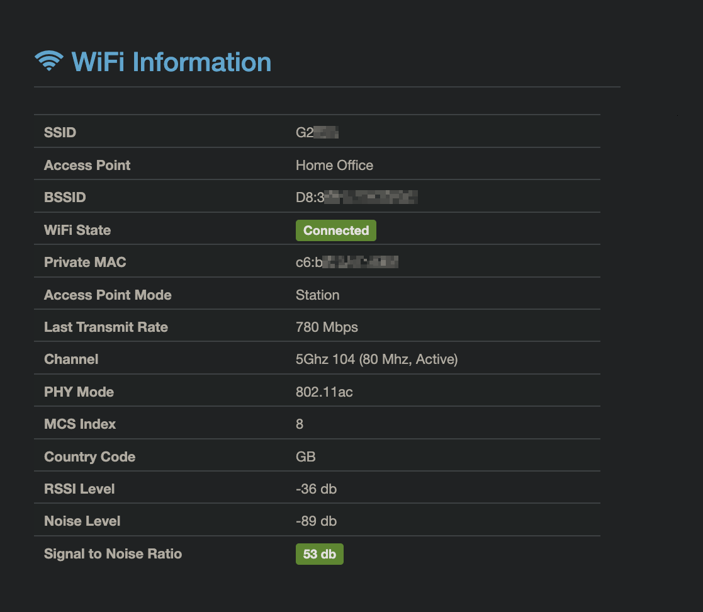

WiFi module
==============

Provides connected WiFi network information gathered by macOS binaries and various WiFi preferences. Additionally offers BSSID alias functionality to associate friendly names with wireless access points.

Client Preferences
---

It is possible to enable the collection of known networks on clients using the preference domain `MunkiReport` with boolean key `wifi_known_networks_enabled` set to `true`. Alternatively, you can run `sudo defaults write /Library/Preferences/MunkiReport.plist wifi_known_networks_enabled -bool true` on the client. Collection of this data is only supported on macOS 11 and newer.

BSSID Alias Configuration
---

The module supports assigning friendly names to BSSIDs (access point MAC addresses) to help identify physical locations:

* Configure aliases in the config file using the `wifi_bssid_aliases` array
* Or use a YAML file at `local/module_configs/bssid_aliases.yml` with the following format:

  ```yaml
  'Alias Name':
    - 'AA:BB:CC:DD:EE:FF'
    - 'GG:HH:II:JJ:KK:LL'
  'Another Alias':
    - 'MM:NN:OO:PP:QQ:RR'
  ```

* The fuzzy matching threshold for BSSIDs can be set with `wifi_bssid_fuzzy_threshold` in the config (default: 1)
  * Set to 0 to require exact matches
  * Higher values allow more permissive matching (useful for multi-radio access points)

Remarks
---

* 'init' state indicates that WiFi is on, but not connected to any networks

Table Schema
---

* agrctlrssi (integer) Aggregate RSSI (decibels)
* agrextrssi (integer) Aggregate external RSSI (decibels)
* agrctlnoise (integer) Aggregate noise (decibels)
* agrextnoise (integer) Aggregate external noise (decibels)
* state (string) WiFi state (running, init, off)
* op_mode (string) Access point mode
* lasttxrate (integer) Last transmit rate (Mbps)
* lastassocstatus (string) Last association status
* maxrate (integer) Maximum supported transmit rate (Mbps)
* x802_11_auth (string) Type of authentication
* link_auth (string) Link authentication type
* bssid (string) Access point's BSSID
* bssid_alias (string) Friendly name for the BSSID
* ssid (string) SSID or name of the connected wireless network
* mcs (string) Modulation and Coding Scheme
* channel (string) Channel of wireless network
* snr (integer) Signal to noise ratio
* known_networks (medium text) JSON string detailing known wireless networks
* phy_mode (string) PHY mode of the current active connection
* country_code (string) Current contry code of the WiFi
* private_mac_address (string) Private MAC address (macOS 15+ only)
* private_mac_mode_user (string) Private MAC address setting (macOS 15+ only)


